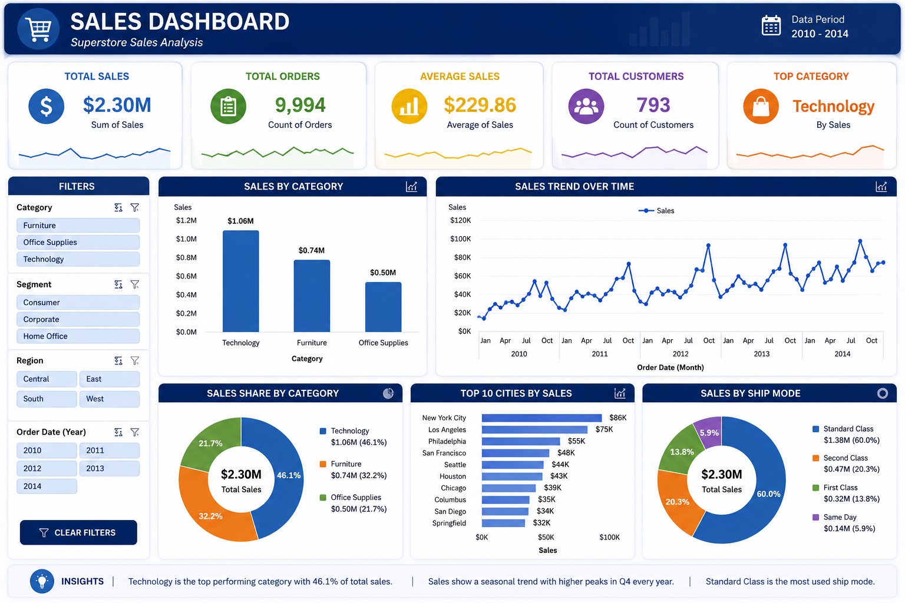
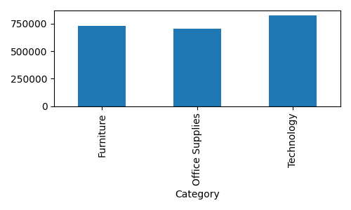
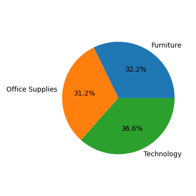

# Task 01 – Excel Sales Dashboard

## Objective

Analyze the Superstore Sales dataset using Microsoft Excel and build an interactive dashboard to visualize business performance.

## Dataset

Superstore Sales Dataset

## Dashboard Features

* Total Sales KPI
* Total Orders KPI
* Average Sales KPI
* Sales by Category
* Sales Trend Over Time
* Sales Share by Category
* Interactive Dashboard Layout
* Conditional Formatting

## Dashboard Preview

## Individual Charts

### Sales by Category

### Sales Trend

### Sales Share

## Tools Used

* Microsoft Excel
* Pivot Tables
* Pivot Charts
* Data Cleaning

## Outcome

The dashboard provides a clear overview of sales performance and enables quick analysis of category-wise sales and overall sales trends.
